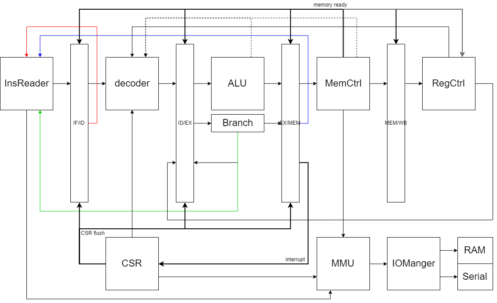

# CPU设计文档

## 总体设计图

上述设计图没有具体地规定模块之间的相应接口，但清晰地刻画了各个模块之间的关系和联系，表现了数据流在各个模块之间的大致方向。

根据以上设计图，我们的CPU分成以下主要模块：

* 顶层模块（CPU）
* 取指模块（InsReader）
* 译码模块（decoder）
* 执行模块（ALU、Branch）
* 访存模块（MemCtrl、MMU）
* 通用寄存器模块（RegCtrl）
* 特权指令模块（CSR）
* I/O管理器模块（IOManager）
* 控制器模块（RAM、Serial）
* 4组流水线寄存器（IF/ID、ID/EX、EX/MEM、MEM/WB）

除此之外，我们的工程还包括以下测试模块：

* 顶层测试模块（CPUTest）
* 虚拟RAM模块（MemoryTest）
* 虚拟串口模块（SerialTest）

以下，我们将对每个模块的接口和功能进行简要概述。在我们的接口中，有一些接口类型是我们自定义的，在文档中，我们把这些接口的定义放在最后。对于这些接口，如果在模块中标明的接口方向为Flipped，表示将它们定义中的Input和Output方向全部取反。

## 顶层模块

顶层模块（cpu.scala）包括总体设计图上除了RAM和串口控制器以外的所有模块。

| 接口名 | 接口方向 | 接口类型 | 注释             |
| ------ | -------- | -------- | ---------------- |
| en     | Input    | Bool     | 流水线使能       |
| mem    | Flipped  | RAMOp    | 连接到RAM控制器  |
| serial | Flipped  | RAMOp    | 连接到串口控制器 |

## 取指模块

取指模块（insreader.scala）是IF阶段进行的操作。这一模块采用组合逻辑实现，需要用到的寄存器被放在IF/ID里。取指受到上一个PC值、MEM段阻塞（见“异步访存设计”）和跳转的共同影响，这三条控制信号线在设计图上用彩色线表示。

| 接口名     | 接口方向 | 接口类型  | 注释                                           |
| ---------- | -------- | --------- | ---------------------------------------------- |
| jump       | Input    | Bool      | 是否进行跳转                                   |
| jdest      | Flipped  | UInt(64)  | 跳转的目标地址                                 |
| nls        | Input    | Bool      | 是否正在执行Load/Store指令的访存，用于异步访存 |
| lpc        | Input    | UInt(64)  | 上一个PC                                       |
| insp       | Input    | UInt(64)  | 预取的指令内容（来自上一个insn）               |
| inspd      | Input    | UInt(64)  | 预取的指令所在地址（来自上一个insnd）          |
| bubble     | Input    | Bool      | 来自decoder的气泡信号                          |
| ins        | Output   | UInt(32)  | 输出的指令                                     |
| pc         | Output   | UInt(64)  | 输出的指令所在的PC                             |
| insn       | Output   | UInt(64)  | 预取的指令内容                                 |
| insnd      | Output   | UInt(64)  | 预取的指令所在地址                             |
| mmu        | Flipped  | MMUOp     | 向MMU发出的访存接口                            |
| mmu_if_rst | Input    | Bool      | 告知MMU是否访存需求发生改变（因为发生跳转）    |
| excep      |          | Exception |                                                |

## 译码模块

译码模块（decoder文件夹，主文件decoder.scala）是负责ID阶段译码的模块，具有三个子模块，insType.scala负责获取指令的类型，aluGen.scala负责获取该指令对应的ALU运算符，immGen.scala负责获取该指令对应的立即数。

在ID阶段除了译码模块发挥作用，RegCtrl模块也进行了寄存器的读取工作，从EX和MEM各连回一条旁路，保证寄存器读到的值的正确性。旁路在设计图上用虚线表示。

| 接口名       | 接口方向 | 接口类型     | 注释                                                         |
| ------------ | -------- | ------------ | ------------------------------------------------------------ |
| ins          | Input    | UInt(32)     | 从IF取出的指令                                               |
| lastload     | Flipped  | LastLoadInfo | 上一周期Load指令读取的寄存器（来自上一个loadinfo），当这一周期需要使用这个寄存器的值时，因为可能来不及写回，所以提供给IF阶段一个气泡 |
| loadinfo     |          | LastLoadInfo | 这一周期Load指令读取的寄存器                                 |
| imm          | Output   | UInt(64)     | 指令的立即数                                                 |
| ALUOp        | Output   | UInt(4)      | 指令的ALU运算符                                              |
| exe_type     | Output   | UInt(4)      | 指令的类型                                                   |
| ls_mode      | Output   | UInt(4)      | 指令的访存类型                                               |
| op32         | Output   | Bool         | 指令的ALU运算符是否为32位运算                                |
| bubble       | Output   | Bool         | 输出给IF的气泡信号                                           |
| regr         | Flipped  | RegReader    | 传递给RegCtrl的读取接口                                      |
| dreg         |          | DecoderReg   | 指令用到的寄存器（rs1，rs2，rd）编号                         |
| csr          |          | ID_CSR       |                                                              |
| csr_content  | Flipped  | WrCsrReg     |                                                              |
| csr_from_ex  |          | WrCsrReg     |                                                              |
| csr_from_mem |          | WrCsrReg     |                                                              |
| exWrReg      | Flipped  | WriteBackReg | 从EX段连过来的寄存器写回旁路                                 |
| memWrReg     | Flipped  | WriteBackReg | 从MEM段连过来的寄存器写回旁路                                |
| if_excep     | Flipped  | Exception    |                                                              |
| ex_excep     |          | Exception    |                                                              |

### 指令类型编码

| 编码 | 指令类型 | 注释              | 编码 | 指令类型 |
| ---- | -------- | ----------------- | ---- | -------- |
| 0000 | ALU      | 算逻指令          | 1000 | JAL      |
| 0001 | SYSC     | 系统调用指令      | 1001 | BEQ      |
| 0010 | LOS      | Load/Store指令    | 1010 | BNE      |
| 0011 | AUIPC    |                   | 1011 | BLT      |
| 0100 | LUI      |                   | 1100 | BGE      |
| 0101 | FENCE    |                   | 1101 | BLTU     |
| 0110 | CSR      | 非立即数CSR指令   | 1110 | BGEU     |
| 0111 | CSRI     | 带立即数的CSR指令 | 1111 | JALR     |

## 执行模块

执行模块（execute文件夹，主文件execute.scala）是负责算逻、跳转、AUIPC、LUI指令执行的模块，其中，LUI和AUIPC直接在主文件内执行，算逻和跳转分别在alu.scala和branch.scala中执行。对于一些Load/Store指令，在执行模块计算出地址。

| 接口名    | 接口方向 | 接口类型     | 注释                           |
| --------- | -------- | ------------ | ------------------------------ |
| imm       | Input    | UInt(64)     | 立即数                         |
| ALUOp     | Input    | UInt(4)      | ALU运算符                      |
| pc        | Input    | UInt(64)     | 从IF传下来的PC，用于AUIPC      |
| exe_type  | Input    | UInt(4)      | 指令类型                       |
| op32      | Input    | Bool         | ALU运算符是否为32位运算        |
| dreg      | Flipped  | DecoderReg   | 指令用到的寄存器编号           |
| nls       | Output   | Bool         | 是否为Load/Store指令           |
| addr      | Output   | UInt(64)     | Load/Store的地址               |
| data      | Output   | UInt(64)     | Store指令写入的值              |
| jump      | Output   | Bool         | 是否发生跳转                   |
| jdest     | Output   | UInt(64)     | 跳转的目标地址                 |
| wreg      |          | WriteBackReg | EX阶段可以得到的寄存器写回信息 |
| wcsr      | Flipped  | WrCsrReg     |                                |
| csr_op    |          | WrCsrReg     |                                |
| id_excep  | Flipped  | Exception    |                                |
| mem_excep |          | Exception    |                                |

## 访存模块

访存模块包括两个部分。

### 访存控制模块

MEM阶段的主模块memoryCtrl.scala，结构比较简单，负责通过EX传过来的信号，向MMU发出访存请求，并将MMU返回的结果传入WB。memoryCtrl的ready信号是异步访存的核心，它控制了寄存器阻塞和流水线流动。

| 接口名 | 接口方向 | 接口类型     | 注释                                                   |
| ------ | -------- | ------------ | ------------------------------------------------------ |
| nls    | Input    | Bool         | 是否为Load/Store指令，不为时，不做任何行为             |
| lsm    | Input    | UInt(4)      | Load/Store的访存模式                                   |
| addr   | Input    | UInt(64)     | Load/Store的访存地址                                   |
| data   | Input    | UInt(64)     | Store的待写入数据                                      |
| ready  | Output   | Bool         | 是否完成了Load/Store操作                               |
| ereg   | Flipped  | WriteBackReg | 从EX段传入的写回信息，如果不是Load/Store，直接传入wreg |
| wreg   |          | WriteBackReg | 从MEM传出给WB的写回信息                                |
| mem    | Flipped  | MMUOp        | 发送给MMU的访存接口                                    |
| excep  | Flipped  | Exception    |                                                        |
| csr_wb |          | WrCsrReg     |                                                        |
| csr    |          | MEM_CSR      |                                                        |
| inter  | Input    | UInt(32)     |                                                        |

### MMU

MMU模块负责虚实地址转换。

MMU包括三个文件，MMU.scala以及子模块PTW.scala和TLB.scala。我们支持了Sv39虚拟内存模式，当一个请求到达MMU时，首先在TLB中查找是否有匹配的页号，如有，直接得到实地址，如无，进入PTW的状态机，逐级在三级页表中进行查找，得到实地址。

MMU得到实地址后，将实地址和对应的访存模式传入IOManager，等待IOManager发出ready信号之后，返回给上层IF或MEM段。

| 接口名   | 接口方向 | 接口类型 | 注释                                                         |
| -------- | -------- | -------- | ------------------------------------------------------------ |
| en       | Input    | Bool     | 使能端，用于初始化                                           |
| mem      |          | MMUOp    | MEM段对MMU发出的请求                                         |
| insr     |          | MMUOp    | IF段对MMU发出的请求                                          |
| insr_rst | Input    | Bool     | IF段的重置信号，当IF发出对MMU的请求之后，如果中途收到了jump指令等要改变PC（访存目标地址）的控制信号，就会给MMU发送重置信号，MMU在完成当前阶段的访存后重新启动状态机，对新的地址进行访存 |
| csr      | Input    | CSR_MMU  | CSR向MMU提供的特权信息                                       |
| if_iom   | Flipped  | RAMOp    | MMU向IOManager发出的请求接口                                 |
| mem_iom  | Flipped  | RAMOp    | MMU向IOManager发出的请求接口                                 |

### 异步访存技术设计简述

因为我们无法将指令和数据放到不同的存储器中，所以IF阶段的取指和MEM阶段的访存必然产生冲突，我们的处理方式是先到先得原则，即：当IF阶段正在访存时，MEM阶段等待直到RAM空闲；当MEM阶段正在访存时，IF阶段等待直到RAM空闲。

#### 指令预取

在MEM阶段访存（即Load/Store语句）比较频繁的情况下，将会发生大量的冲突，我们设计了一个指令预取技术来解决这个冲突。因为一次读取64位数据，所以我们可以一次读取两条指令，放在IF/ID的insc（Instruction Cache）寄存器中，并将其地址写入icd寄存器中。在下一个周期读取指令时，如果发现PC和icd的值在同一个64位区域中，那么不进行RAM读取，而是直接从预取的insc中取出指令。

#### 气泡

Insreader模块持续进行工作。当MEM阶段正在访存时，指示信号nls（Need Load/Store）通知Insreader，如果指令预取无法取出下一条指令，Insreader就会进入假工作状态，对外输出中，PC为下一条指令的地址-4（这样在下一个周期，PC正常移动的目标地址不变），其他数据均为空指令。

#### 寄存器阻塞

寄存器阻塞发生在MEM阶段访存期间。因为MEM占用RAM时无法进行取指，所以流水线无法流动。我们让MEM阶段访存期间的所有流水线寄存器输出端不更新，这样ID和EX段都处在“持续状态”，保持相同的状态，以便在当前访存完成之后的下一个周期，MEM阶段可以读取到正确的值。

## 通用寄存器模块

通用寄存器模块（reg.scala）是管理通用寄存器堆读写的模块。

| 接口名 | 接口方向 | 接口类型  | 注释                           |
| ------ | -------- | --------- | ------------------------------ |
| r      |          | RegReader | ID阶段发给寄存器堆的读请求接口 |
| w      |          | RegWriter | WB阶段发给寄存器堆的写请求接口 |
| pass   | Input    | Bool      | 指示寄存器是否阻塞的信号       |

## 特权指令模块

## I/O管理器模块

I/O管理器模块（iomanager.scala）是连接CPU和硬件控制器的接口，这个模块接受从MMU模块传递过来的实地址，用这个实地址向RAM或串口发起请求。等待Load/Store完成之后，发回ready信号通知MMU模块访存操作完成。

| 接口名     | 接口方向 | 接口类型 | 注释                                     |
| ---------- | -------- | -------- | ---------------------------------------- |
| mem_if     |          | RAMOp    | IF段（insreader）通过MMU发送的访存请求   |
| mem_mem    |          | RAMOp    | MEM段（memoryCtrl）通过MMU发送的访存请求 |
| mem_out    | Flipped  | RAMOp    | 发送给RAM控制器的请求                    |
| serial_out | Flipped  | RAMOp    | 发送给串口控制器的请求                   |

对于串口而言，每次只读或写一个字节，使用LBU或SB的访存模式。

## 控制器模块

## 流水线寄存器

在五级流水线的每两级之间，设计有流水线寄存器：IF_ID、ID_EX、EX_MEM、MEM_WB。流水线寄存器的设计是相似的：

| 接口名 | 接口方向 | 接口类型 | 注释                                                         |
| ------ | -------- | -------- | ------------------------------------------------------------ |
| en     | Input    | Bool     | 流水线使能端                                                 |
| pass   | Input    | Bool     | 控制寄存器阻塞的信号                                         |
| flush  | Input    | Bool     | 控制异常清空流水线的信号，除了PC外，由于异常清空流水线时，流水线寄存器被置为默认值 |

对于每个流水线寄存器，都对应一个i结尾的Input接口，和一个o结尾的Output接口。Input接口直接接入输入线，并修改寄存器的值。当en和pass都打开时，于时钟跳变时，Output接口会更新值。

以下是各阶段的流水线寄存器。

### IF_ID

| 寄存器名       | 寄存器类型 | 注释                                       |
| -------------- | ---------- | ------------------------------------------ |
| ins            | UInt(32)   | IF段读取出的指令                           |
| pc             | UInt(64)   | PC（和ins对应）                            |
| insc           | UInt(64)   | IF段指令预取读到的指令Cache（IF段回环）    |
| icd            | UInt(64)   | IF段预取指令的地址（IF段回环）             |
| lastload_valid | Bool       | 上一条指令是否为Load指令（ID段回环）       |
| lastload_index | UInt(5)    | 上一条指令Load的目标寄存器编号（ID段回环） |
| excep          | Exception  |                                            |

### ID_EX

| 寄存器名 | 寄存器类型 | 注释                             |
| -------- | ---------- | -------------------------------- |
| imm      | UInt(64)   | ID段读取到的立即数               |
| ALUOp    | UInt(4)    | ID段读取到的ALU运算符            |
| exet     | UInt(4)    | ID段读取到的指令类型             |
| pc       | UInt(64)   | IF/ID传过来的PC（用于AUIPC）     |
| lsm      | UInt(4)    | ID段读取到的Load/Store访存模式   |
| op32     | Bool       | ID段读到的ALU运算是否为32位运算  |
| dreg     | DecoderReg | ID段读到的读入和写入的寄存器编号 |
| csr_wb   | WrCsrReg   |                                  |
| excep    | Exception  |                                  |

### EX_MEM

| 寄存器名 | 寄存器类型   | 注释                                     |
| -------- | ------------ | ---------------------------------------- |
| nls      | Bool         | 下一周期是否需要Load/Store（传递给IF段） |
| lsm      | UInt(4)      | 访存模式                                 |
| addr     | UInt(64)     | 访存地址                                 |
| data     | UInt(64)     | 写入模式下待写入的数据                   |
| wreg     | WriteBackReg | EX段计算出即将准备写入的寄存器编号和数据 |
| csr_wb   | WrCsrReg     |                                          |
| excep    | Exception    |                                          |
| inter    | UInt(32)     |                                          |

### MEM_WB

注：因为异常是在MEM段产生的，所以在异常发生清空流水线的时候，MEM_WB并不会被清空。

| 寄存器名 | 寄存器类型   | 注释                                  |
| -------- | ------------ | ------------------------------------- |
| wreg     | WriteBackReg | MEM段计算出即将写入的寄存器编号和数据 |

## 顶层测试模块

顶层测试模块（cpuTest.scala）是用于在软件环境下进行仿真测试的模块，使用顶层测试模块进行测试，可以获取在chisel代码内写入的print语句的输出，和用于查看波形的vcd文件，非常方便地进行测试和调试。

在顶层测试模块中，嵌入了一整个CPU顶层模块，以及RAM和串口的模拟控制器。

| 接口名      | 接口方向 | 接口类型 | 注释                                                         |
| ----------- | -------- | -------- | ------------------------------------------------------------ |
| en          | Input    | Bool     | CPU的使能端                                                  |
| init        | Input    | Bool     | 虚拟RAM写入的初始化信号                                      |
| dd          | Input    | UInt(32) | 向虚拟RAM写入的初始化数据                                    |
| init_serial | Input    | Bool     | 虚拟串口写入的初始化信号                                     |
| dd_serial   | Input    | UInt(8)  | 向虚拟串口写入的初始化数据                                   |
| wbd         | Output   | UInt(64) | 这个信号没有实际作用，但在测试时发现如果没有输出信号，整个模块会被优化掉，所以补上了一个输出信号 |

## 虚拟控制器模块

虚拟RAM模块（memoryTest.scala）实现了一个大小为16MB的虚拟RAM，实现了各种访存模式。在初始化的时候，先给出一个init初始化信号，然后每个周期送入一个dd（32位的初始化数据），将初始化的这些数据写入到RAM的起始段。这个功能，我们在测试的时候用来将程序的指令写入虚拟RAM。

虚拟串口模块（serialTest.scala）和虚拟RAM模块相似，但只限LBU和SB两个访存模式。虚拟串口模块初始化时，每次写入一个字节的数据，存在缓冲区内。这些初始化的数据会在每次调用对串口的LBU时读出一个字节。而调用对串口的SB时，直接将SB的一个字节的数据用chisel的print以字符形式输出在控制台。

在虚拟RAM中的指令、虚拟串口中的读缓冲区都初始化完毕之后，把顶层测试模块的en打开，CPU流水线开始运作。

## 附录：自定义接口类型

### RegReader

用于向通用寄存器控制模块发送读请求。

| 接口名 | 接口方向 | 接口类型 | 注释               |
| ------ | -------- | -------- | ------------------ |
| r1     | Input    | UInt(5)  | 寄存器的编号       |
| r2     | Input    | UInt(5)  | 寄存器的编号       |
| r1d    | Output   | UInt(64) | 读出的寄存器的数据 |
| r2d    | Output   | UInt(64) | 读出的寄存器的数据 |

### RegWriter

用于向通用寄存器控制模块发送写请求。

| 接口名 | 接口方向 | 接口类型 | 注释               |
| ------ | -------- | -------- | ------------------ |
| wen    | Input    | Bool     | 是否写入           |
| w      | Input    | UInt(5)  | 写入寄存器的编号   |
| wd     | Input    | UInt(64) | 写入到寄存器的数据 |

### WriteBackReg

用于记录写回信息。

| 接口名 | 接口方向 | 接口类型 | 注释               |
| ------ | -------- | -------- | ------------------ |
| wbrv   | Input    | Bool     | 是否写入           |
| wbri   | Input    | UInt(5)  | 写入寄存器的编号   |
| wbrd   | Input    | UInt(64) | 写入到寄存器的数据 |

### RAMOp、MMUOp

用于表示访存接口。

| 接口名    | 接口方向 | 接口类型 | 注释                            |
| --------- | -------- | -------- | ------------------------------- |
| mode      | Input    | UInt(4)  | 访存模式                        |
| ready     | Output   | Bool     | 访存完成信号                    |
| addr      | Input    | UInt(64) | 访存目标地址                    |
| rdata     | Output   | UInt(64) | Load读出的数据                  |
| wdata     | Input    | UInt(64) | Store要写入的数据               |
| pageFault | Output   | Bool     | MMUOp特有的信号，表示发生页异常 |

### DecoderReg

用于表示decoder得到的寄存器信息。

| 接口名    | 接口方向 | 接口类型 | 注释                    |
| --------- | -------- | -------- | ----------------------- |
| rs1_valid | Output   | Bool     | 指令是否用到了rs1寄存器 |
| rs2_valid | Output   | Bool     | 指令是否用到了rs2寄存器 |
| rs1_value | Output   | UInt(64) | 读出的rs1寄存器的值     |
| rs2_value | Output   | UInt(64) | 读出的rs2寄存器的值     |
| rd_valid  | Output   | Bool     | 指令是否用到了rd寄存器  |
| rd_index  | Output   | UInt(5)  | rd寄存器的编号          |

### ID_CSR

### WrCsrReg

### CsrWriteBack

### LastLoadInfo

用于记录上一句Load指令的信息。

| 接口名 | 接口方向 | 接口类型 | 注释                   |
| ------ | -------- | -------- | ---------------------- |
| valid  | Output   | Bool     | 是否为Load指令         |
| index  | Output   | UInt(5)  | Load指令读的寄存器编号 |

### MEM_CSR

### CSR_MMU

### Exception