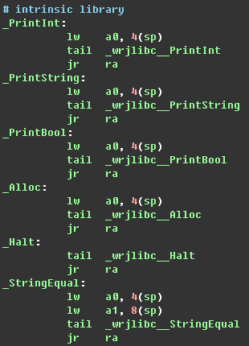
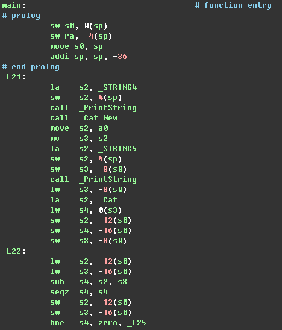

## Decaf报告  

Decaf的工作包括了两个部分：
第一个是生成RiscV的汇编代码，这个也是编译原理课程的要求。
第二个是用高级语言（C语言）实现Decaf的内置函数。

### Decaf 后端代码生成
在Decaf框架中，后端代码生成的流程是：
1.对之前生成的中间代码（TAC）做数据流分析；
2.接着完成寄存器分配，将TAC使用的虚拟寄存器转变成物理寄存器；
3.使用目标架构的指令（RiscV指令集）完成TAC需要的操作。

### 生成汇编代码
为了使得Decaf框架生成的是RiscV的汇编代码，在原有的框架基础上做了一些改动。

基本工作是将代码中Mips指令全都改成RiscV的指令。
其中包括一些细节，比如修改寄存器名，以及将一些RiscV里没有的指令拆解成RiscV中的指令。

### 运行时
以上过程生成的汇编代码并不能运行，因为这个汇编代码会使用Decaf自带的内置函数，而这些内置函数还没有被实现。

因此，我们使用 C 语言实现这套内置函数，生成了一个函数库（o文件），并将此用于与Decaf生成的汇编代码的链接。
预定计划如此，但实际实现中链接方式出了差错，所以流程便卡在了生成的RiscV汇编代码上。

生成的汇编代码：

可以看到汇编代码使用了内置函数

主函数本体

使用C语言实现的函数库：

